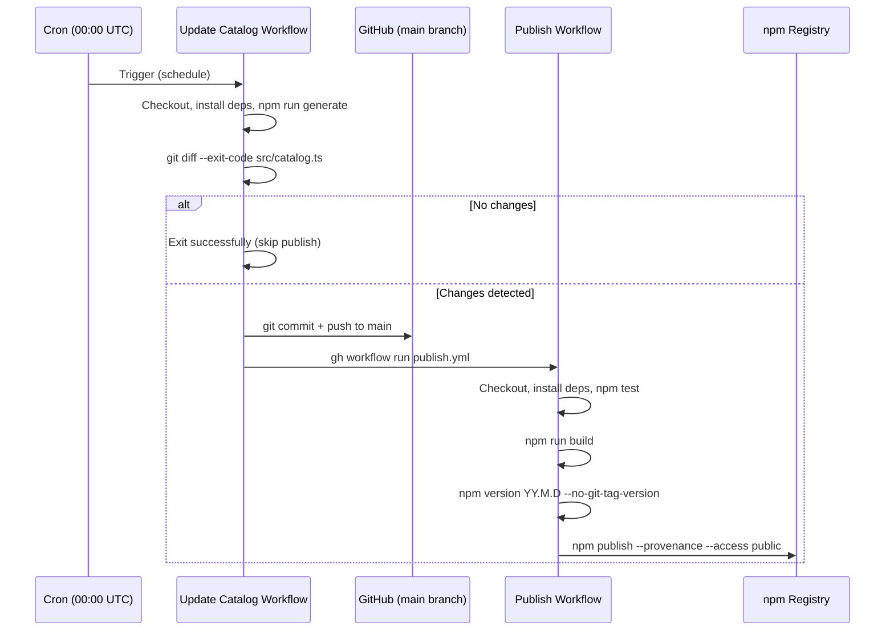
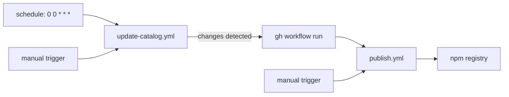

# Design Document: Catalog Publisher

## Overview

The Catalog Publisher automates daily publishing of the `@beesolve/iam-policy-ts` npm package by combining two GitHub Actions workflows:

1. **Update Catalog Workflow** (`update-catalog.yml`) — runs daily at midnight UTC, fetches the upstream AWS IAM catalog, detects changes via `git diff`, commits to main, and triggers the publish workflow.
2. **Publish Workflow** (`publish.yml`) — triggered exclusively via `workflow_dispatch`, runs tests, builds, sets a date-based version, and publishes with npm trusted publishing (OIDC + provenance).

This design requires no changes to the existing package source code. The only deliverables are two YAML workflow files.



### Design Rationale

- **Two separate workflows** instead of one: The publish workflow is independently triggerable for republishing after code fixes (e.g., changes to `helpers.ts` or `schema.ts`) without re-running catalog generation.
- **`workflow_dispatch` + `gh` CLI** instead of push-triggered publish: Avoids infinite loops from bot commits triggering workflows, and gives explicit control over when publishing happens.
- **`git diff --exit-code`** for change detection: Simple, reliable, no external state needed. Exit code 0 = no changes, exit code 1 = changes exist.
- **Date-based versioning**: Consumers can identify when catalog data was captured. Each publish overwrites the version in `package.json` without committing it back (the version in the repo stays at `0.1.0`).

## Architecture

### Workflow Relationship



### Update Catalog Workflow Steps

| Step | Action | Failure Behavior |
|------|--------|-----------------|
| 1 | `actions/checkout@v4` | Workflow fails |
| 2 | `actions/setup-node@v4` (Node 24) | Workflow fails |
| 3 | `npm ci` | Workflow fails |
| 4 | `npm run generate` | Workflow fails |
| 5 | `git diff --exit-code src/catalog.ts` | Exit 0: skip remaining steps. Exit 1: continue. Other: fail |
| 6 | Configure git user (github-actions[bot]) | Workflow fails |
| 7 | `git add src/catalog.ts` | Workflow fails |
| 8 | `git commit -m "chore: update catalog"` | Workflow fails |
| 9 | `git push` | Workflow fails |
| 10 | `gh workflow run publish.yml` | Workflow fails |

### Publish Workflow Steps

| Step | Action | Failure Behavior |
|------|--------|-----------------|
| 1 | `actions/checkout@v4` | Workflow fails |
| 2 | `actions/setup-node@v4` (Node 24, registry-url) | Workflow fails |
| 3 | `npm ci` | Workflow fails |
| 4 | `npm test` | Workflow fails, skip publish |
| 5 | `npm run build` | Workflow fails, skip publish |
| 6 | `npm version $(date -u +%-y-%-m-%-d) --no-git-tag-version` | Workflow fails, skip publish |
| 7 | `npm publish --provenance --access public` | Workflow fails |

## Components and Interfaces

### File Structure

```
.github/
  workflows/
    update-catalog.yml    # Update Catalog Workflow
    publish.yml           # Publish Workflow
```

No other files are created or modified. The existing project files remain unchanged:
- `scripts/generate-catalog.mjs` — catalog fetching and normalization (already exists)
- `package.json` — build/test scripts (already exists)
- `src/catalog.ts` — generated catalog output (already exists, updated by workflow)

### Update Catalog Workflow Interface

```yaml
# .github/workflows/update-catalog.yml
name: Update Catalog

on:
  schedule:
    - cron: "0 0 * * *"
  workflow_dispatch:

permissions:
  contents: write

jobs:
  update:
    runs-on: ubuntu-latest
    steps:
      # Steps 1-10 as described in Architecture section
```

**Inputs**: None (triggered by cron or manual dispatch)
**Outputs**: Commit on main + workflow_dispatch event on publish.yml (only when changes detected)
**Authentication**: Default `GITHUB_TOKEN` (contents: write for push, used via `GH_TOKEN` env var for `gh` CLI)

### Publish Workflow Interface

```yaml
# .github/workflows/publish.yml
name: Publish

on:
  workflow_dispatch:

permissions:
  id-token: write
  contents: read

jobs:
  publish:
    runs-on: ubuntu-latest
    steps:
      # Steps 1-7 as described in Architecture section
```

**Inputs**: None (triggered by workflow_dispatch from update workflow or manual)
**Outputs**: Published package on npm registry with provenance attestation
**Authentication**: OIDC token exchange (no stored secrets)

### Change Detection Mechanism

The change detection uses `git diff --exit-code src/catalog.ts` with conditional step execution:

```yaml
- name: Check for changes
  id: diff
  run: |
    if git diff --exit-code src/catalog.ts; then
      echo "changed=false" >> "$GITHUB_OUTPUT"
    else
      echo "changed=true" >> "$GITHUB_OUTPUT"
    fi

- name: Commit changes
  if: steps.diff.outputs.changed == 'true'
  run: |
    # commit and push steps
```

This approach:
- Captures the diff result as a step output
- Uses GitHub Actions `if` conditionals to skip subsequent steps when no changes exist
- Lets fatal git errors (exit code > 1) propagate as workflow failures

### Trusted Publishing (OIDC) Mechanism

npm trusted publishing works as follows:

1. **Pre-requisite (one-time manual setup)**: On npmjs.com, the package `@beesolve/iam-policy-ts` is configured to trust the GitHub repository `beesolve/iam-policy-ts`, workflow file `publish.yml`, with no environment restriction.
2. **At publish time**: The `actions/setup-node@v4` action with `registry-url: https://registry.npmjs.org` configures the `.npmrc` file. GitHub Actions provides an OIDC token via the `id-token: write` permission. npm exchanges this token for a short-lived publish credential.
3. **`--provenance` flag**: Attaches a signed attestation linking the published package to the exact source commit and workflow run.

No `NPM_TOKEN` secret is stored in the repository. No token rotation is needed.

## Data Models

This feature does not introduce new data models. The workflows operate on:

- **`src/catalog.ts`** — existing generated TypeScript file (read/written by `npm run generate`)
- **`package.json`** — existing package manifest (version field updated in-memory during publish, not committed back)
- **Git state** — commits on the main branch
- **npm registry state** — published package versions

### Version Format

The requirements specify a `YYYY-MM-DD` format (e.g., `2025-07-14`). However, npm requires valid semver for the `version` field. The hyphenated date format is not valid semver.

**Design decision**: Use dot-separated date format `YY.M.D` (e.g., `25.7.14`) which is valid semver (major.minor.patch = 2-digit-year.month.day). This preserves the date-based semantics while satisfying npm's version constraints and keeping versions concise.

The workflow command:

```bash
npm version "$(date -u +'%-y.%-m.%-d')" --no-git-tag-version
```

This produces versions like `25.7.14` — consumers can still identify the catalog capture date from the version number.

## Error Handling

### Update Catalog Workflow

| Failure Point | Behavior | Recovery |
|---------------|----------|----------|
| Checkout fails | Workflow fails immediately | Retry on next cron run or manual dispatch |
| `npm ci` fails | Workflow fails | Check lockfile integrity, retry |
| `npm run generate` fails (network) | Workflow fails | Retry on next cron run; upstream may be temporarily unavailable |
| `npm run generate` fails (parse) | Workflow fails | Upstream format may have changed; requires manual investigation |
| `git diff` fatal error | Workflow fails | Investigate git state |
| `git push` fails (conflict) | Workflow fails | Unlikely on bot-only commits; retry on next run |
| `gh workflow run` fails | Workflow fails | Publish can be triggered manually |

### Publish Workflow

| Failure Point | Behavior | Recovery |
|---------------|----------|----------|
| `npm test` fails | Workflow fails, no publish | Fix tests, re-trigger manually |
| `npm run build` fails | Workflow fails, no publish | Fix build errors, re-trigger manually |
| `npm version` fails | Workflow fails, no publish | Investigate version conflict |
| `npm publish` fails (OIDC) | Workflow fails | Verify trusted publishing config on npmjs.com |
| `npm publish` fails (duplicate version) | Workflow fails | Version already published for today; no action needed |

### Idempotency Considerations

- Running the update workflow twice on the same day with no upstream changes: second run detects no diff, exits cleanly.
- Running the publish workflow twice on the same day: second run fails at `npm publish` because the version already exists on npm. This is acceptable — the package is already published.

## Testing Strategy

### Why Property-Based Testing Does Not Apply

This feature consists entirely of declarative CI/CD configuration (GitHub Actions YAML files). There are:
- No pure functions to test
- No data transformations
- No parsers or serializers
- No business logic with varying inputs

The workflows interact exclusively with external services (GitHub, npm, git). PBT is not appropriate for IaC/CI configuration.

### Validation Approach

Since the deliverables are two YAML files with no runtime code, testing focuses on:

1. **YAML Syntax Validation**: Verify both workflow files are valid YAML.
2. **GitHub Actions Schema Validation**: Verify workflow files conform to the GitHub Actions workflow schema (correct trigger types, valid step structure, proper `uses` action references).
3. **Manual Smoke Testing**: Trigger each workflow manually via `workflow_dispatch` to verify end-to-end behavior.
4. **Dry-Run Verification**: Before the first real publish, verify the OIDC trust relationship is configured correctly on npmjs.com.

### Test Checklist

- [ ] `update-catalog.yml` is valid YAML and passes `actionlint`
- [ ] `publish.yml` is valid YAML and passes `actionlint`
- [ ] Manual trigger of update workflow fetches catalog and detects changes correctly
- [ ] Manual trigger of publish workflow completes test → build → version → publish cycle
- [ ] Trusted publishing OIDC token exchange succeeds (verified on first real publish)
- [ ] No-change scenario: update workflow exits cleanly without committing or triggering publish
